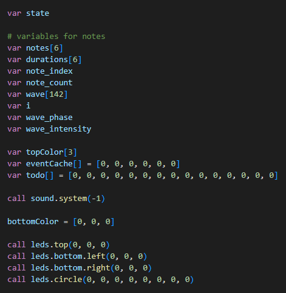

# Aseba-Syntax

VSCode extension for [Aseba](https://github.com/aseba-community/aseba) language.

## Features

Syntax highlighting for Aseba language.

- [x] keywords (var, const, onevent, if, ...)
- [x] # comments and #* comments *#
- [x] # TODO and # FIXME
- [x] HTML elements before and after the Aseba code for .aesl exported files

## Requirements

## Extension Settings

## Known Issues

## Release Notes

### 1.0.0

Initial release with Aseba syntax highlighting.
Includes keywords, comments, TODO, FIXME and HTML elements.
